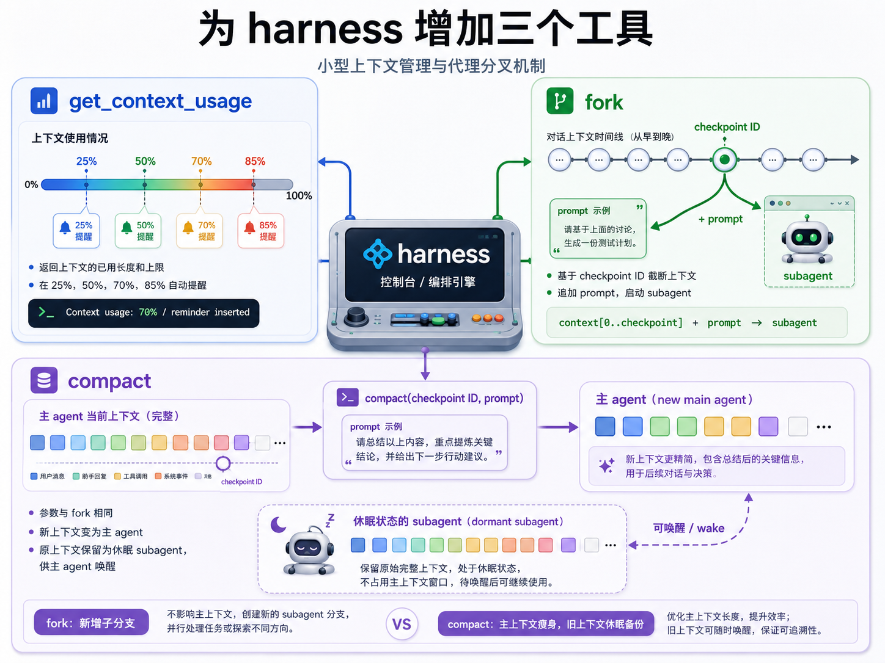

在[上一篇](./harness-frontline-observation-1)中，我们讨论了主流的 harness 功能。自然地，我们想知道：未来的 harness 需要哪些功能？

## 真正重要的能力

首先做一个概念上的区分：本文所讨论的 harness 功能不包括提示词。AGENTS.md、skills 之类提示词组件远比 harness 本身更易采用和替换，因此 harness 不应捆绑大量的提示词。
提示词工程与模型共同演进的问题超出了本文的范围，此处不作展开。 

有很多人认为我们不需要额外的 harness 功能：随着模型能力的增强，许多功能都将变得不再必要。
但我觉得并非如此。诚然，有一些功能完全是为了给能力不足的模型一些（提示性或强制性的）辅助，而当这些功能已经被更强的模型内化之后，他们在 harness 中的存在就显得多余。 
但我认为有两类功能不在此列，无关模型能力如何：

- 本质能力：如果 harness 不提供，agent 便无法获得的能力
  比如说很多 harness 不允许 agent 通过 tool call 重新加载自己的插件，这使得 agent 完全无法写 MCP 给自己或自己的 subagent 使用[^1]。
- 经济性能力：如果 harness 不提供，就需要 agent 以一种更间接、更浪费 token 的方式实现的能力
  比如说如果 harness 不提供带通知的异步 bash 调用，agent 就会进行轮询，造成不必要的资源浪费。

本篇主要聚焦于本质能力。具体来说，是比现在的 harness 所提供的更加强大、更加难以驾驭的能力。

## 主动上下文管理的理念

Harness 生态如此成熟，难道真的有漏掉的本质能力吗？有的。

在绝大多数 harness 中，agent 完全无法管理自己的上下文，只能被动地不断添加，直到用户主动更换 session 或 compact，或者是触发自动 compact 为止。

我觉得这不好。现在的模型管理 subagent 的能力已经很强，那么为什么不让它管理一下它自己呢？

具体来说，我希望这种主动上下文管理实现以下几个目标：

1. 避免浪费：结合大模型 API 的价格特征，尽量不带来额外成本
2. 用户无感：降低用户的心智负担，理想情况下能让用户完全无视上下文窗口的存在
3. 可持久化：上下文管理操作不应贸然永久性地删除信息

## 我设想的方案

为 harness 增加三个工具：

- `get_context_usage`：返回上下文的已用长度和上限；在 25%、50%、70% 和 85% 时各插入一次提醒。
- `fork`：由模型给定一个 checkpoint ID 和一段 prompt，以截至该 ID 前的上下文外加这段 prompt 启动一个 subagent。
- `compact`：参数与 `fork` 相同，但新上下文变为主 agent，原有的上下文保留为休眠状态的 subagent，供主 agent 唤醒。

出乎意料地，主动上下文管理几乎只在学术界有所研究，而没被任何主流 harness 采纳。
我发现的唯一例外是 Kimi CLI 的实验性功能 [SendDMail](https://www.kimi-cli.com/zh/customization/agents.html#senddmail)，但 Kimi CLI 已经被完全重写的 Kimi Code 取代了，这一功能也没被保留。

主动上下文管理真的多余吗？我认为不是。姑且立帖为证，相信时间会给出答案的。

[^1]: 从一种抬杠的视角看，agent 可以通过 kill 掉自己的进程再 resume 来实现这种能力。但这太过分了，我想没有哪个模型会主动这么做。
